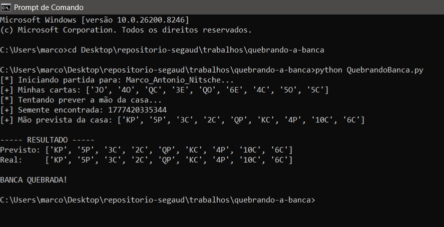
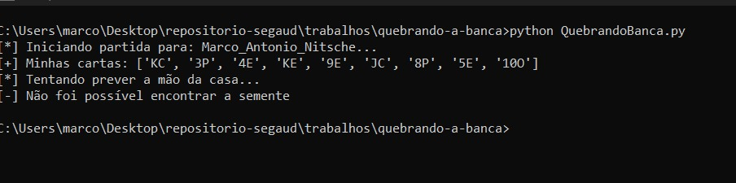

# Quebrando a banca

Não esquecer:

instalar bibliotecas, se preciso:

```
pip install fastapi uvicorn requests
```

```
uvicorn servidorJogo:app --reload
```

## Como rodar os arquivos?

- Salva os dois aquivos em uma mesma pasta
- Roda primeiro o servidorJogo, no terminal com:

```
uvicorn servidorJogo:app --reload
```

- Abre outro terminal e executa:

```
python QuebrandoBanca.py
```

## Como descobrir a forma para quebrar a banca?

Em termos técnicos, o uso de timestamp como semente reduz drasticamente a entropia do sistema, tornando o espaço de busca pequeno e previsível. Como o gerador é determinístico, basta testar valores próximos ao tempo conhecido para reproduzir toda a sequência pseudoaleatória.

A semente sempre vai ser a quantidade exata de segundos que se passaram desde 01/01/1970 até o momento que roda o código QuebraBanca.py

Vai contra o principio da **Entropia**, que  mede a aleatoriedade e imprevisibilidade dos dados.

## Como corrigir a falha?

Usando ***secrets***. A diferença é que o random é determinístico e reproduzível a partir de uma seed, enquanto o secrets utiliza fontes imprevisíveis do sistema, garantindo aleatoriedade criptograficamente segura. 

## Execuções

QuebraBanca.py:



ServidorJogoAjustado.py, basicamente é uma cópia de servidorJogo, só que usando secrets, onde após inicializar o servidor, o QuebraBanca.py já não funciona mais:


